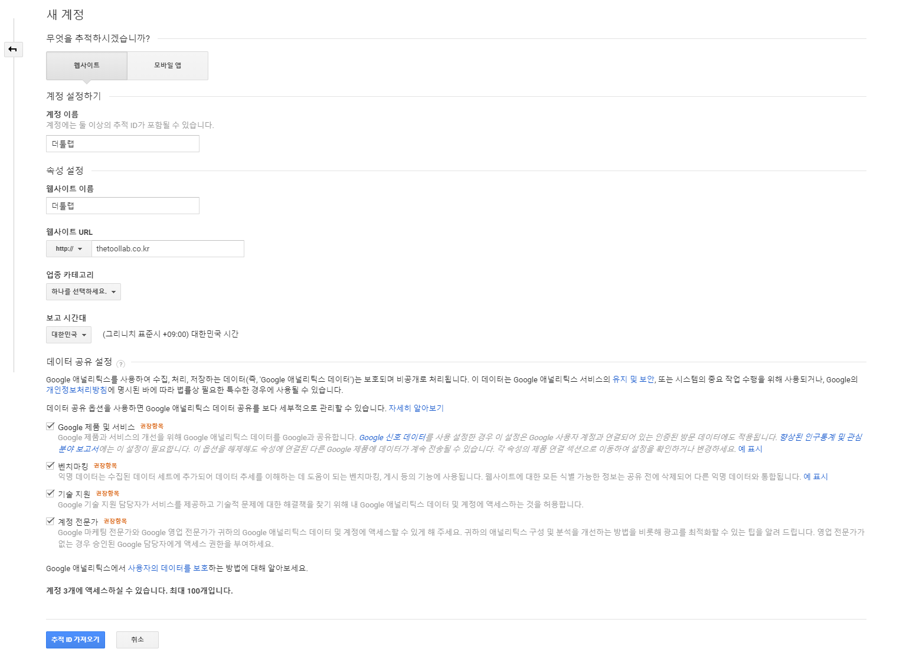
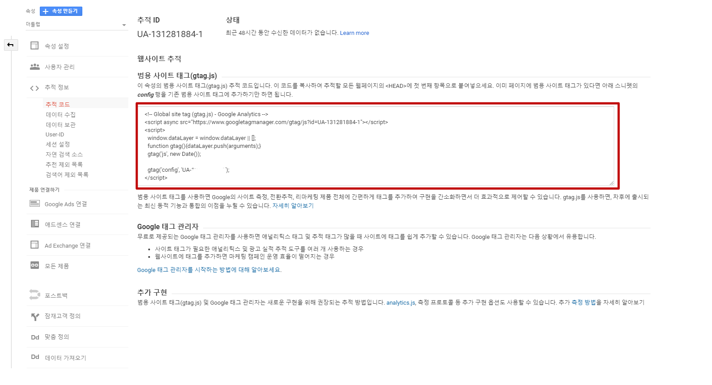
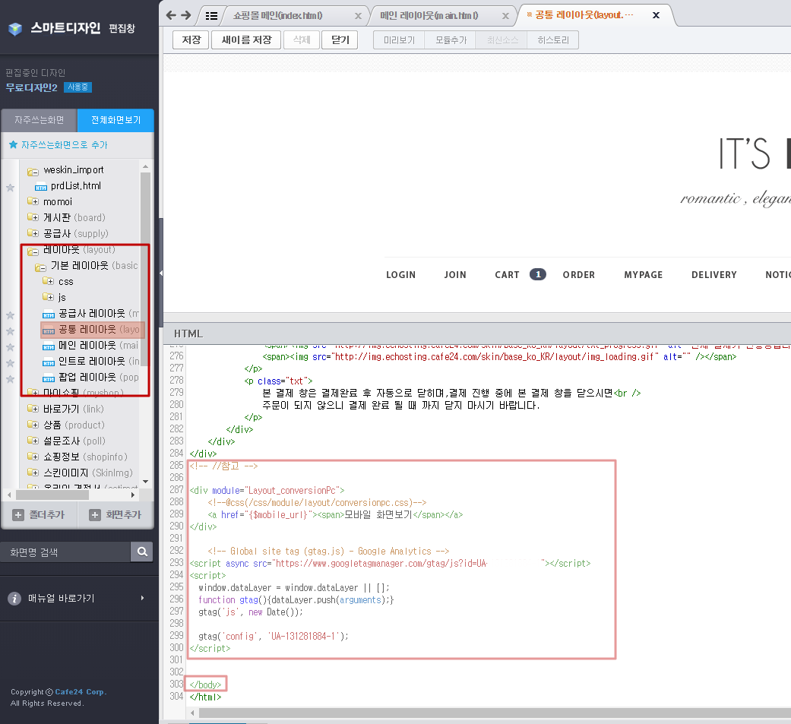
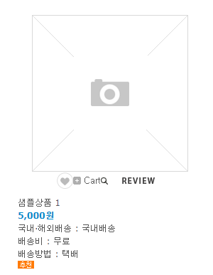
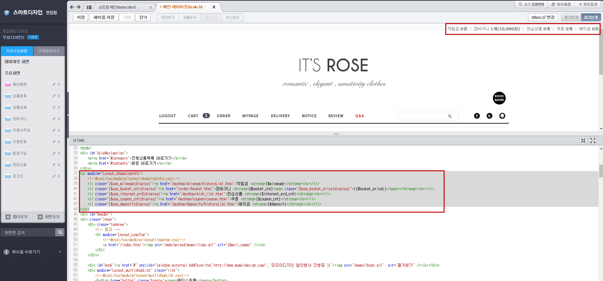

# cafe 24 목록

## 1. 구글 애널리틱스 적용

구글 애널리틱스 페이지 가입 (https://marketingplatform.google.com/about/analytics/)

1. 구글 애널리틱스 계정생성

    

2. 추적태그 확인

    

3. 홈페이지내 추적태그 삽입

    

    #### 태그 삽입 파일

    레이아웃 > 기본레이아웃 > 공통 레이아옷(layout.html)

    추적태그의 위치는 ```</body>``` 위쪽

## 2. 상품 리스트 
### 상품별 적용
변수명|설명
------------ | -------------
{$list_wish_icon} | 위시리스트 추가
{$basket_icon} | 장바구니 추가


### 게시판 이동
* ```<a href="/front/php/b/board_list.php?board_no=4">이미지</a> ``` 리뷰
```html
<div class="icon">
    <div class="button">
        {$list_wish_icon}
        {$basket_icon} 
        <a href="/front/php/b/board_list.php?board_no=4"></a>
    </div>
</div> 
```



## 3. 개인별 적립금등 정보 표시

로그인된 사용자의 적립금, 장바구니, 관심상품, 쿠폰, 예치금 정보를 표시
```html
<ul module="Layout_shoppingInfo">
    <!--@css(/css/module/layout/shoppingInfo.css)-->
    <li class="{$use_mileage|display}"><a href="/myshop/mileage/historyList.html">적립금 <strong>{$mileage}</strong></a></li>
    <li class="{$use_basket_cnt|display}"><a href="/order/basket.html">장바구니 <strong>{$basket_cnt}<span class="{$use_basket_price|display}">({$basket_price})</span></strong></a></li>
    <li class="{$use_interest_prd|display}"><a href="/myshop/wish_list.html">관심상품 <strong>{$interest_prd_cnt}</strong></a></li>
    <li class="{$use_coupon_cnt|display}"><a href="/myshop/coupon/coupon.html">쿠폰 <strong>{$coupon_cnt}</strong></a></li>
    <li class="{$use_deposit|display}"><a href="/myshop/deposits/historyList.html">예치금 <strong>{$deposit}</strong></a></li>
</ul>
```


